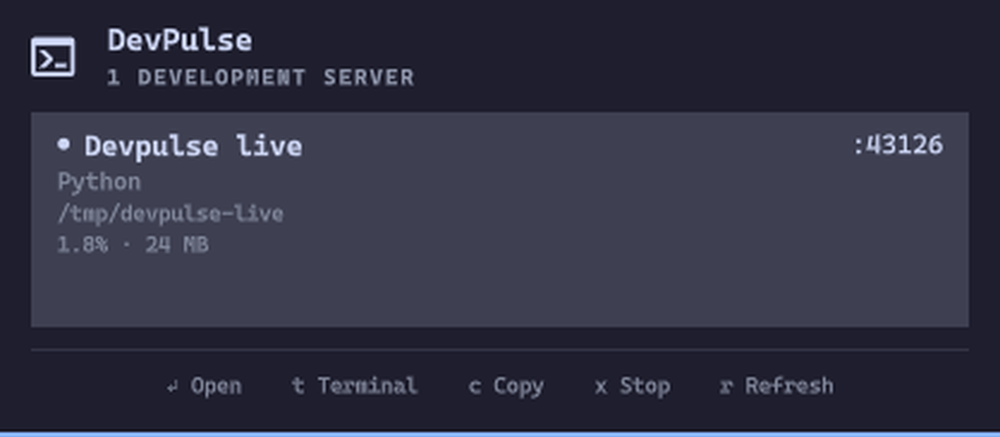

# DevPulse

[](https://github.com/gashiartim/devpulse/actions/workflows/ci.yml)

DevPulse is a keyboard-first Omarchy observability dashboard for local development servers. See what is running, which branch it belongs to, whether it is reachable, and what it is consuming—without project configuration.

## Features

- Automatic local process and published Docker-container discovery
- Best-effort framework and runtime detection (Next.js, Vite, RedwoodJS, NestJS, Astro, Nuxt, Remix/React Router, Django, FastAPI/Uvicorn, Flask, Rails, Go, Rust, and PHP)
- Project names and compact working-directory paths
- Git branch and dirty-state indicator
- CPU, memory, and process uptime
- Concurrent HTTP/HTTPS readiness probes that prevent opening non-web listeners
- LAN-exposure warnings for wildcard and non-loopback bindings
- Search by project, framework, runtime, port, branch, command, or path
- Configurable include/ignore port lists with bounded range support
- Open the selected server in the default browser
- Open a terminal in the project directory or launch the configured editor
- Copy the detected web URL or raw listener address
- Safe, confirmed SIGTERM stop with UID, process-start-time, and live socket-ownership verification
- Adaptive polling: fast while the panel is open and battery-friendly in the background
- Keyboard navigation with native Omarchy panel behavior and stable selection across refreshes
- Native Omarchy bar widget and popup styling

## Screenshot



## Installation

Install DevPulse from its public GitHub repository:

```bash
omarchy plugin add https://github.com/gashiartim/devpulse.git --enable
```

Omarchy validates `manifest.json`, places the plugin in `~/.config/omarchy/plugins/io.github.gashiartim.devpulse/`, and enables the bar widget. Review third-party plugin code before enabling it because Omarchy plugins run unsandboxed.

For a local checkout during development, copy the folder there and run:

```bash
omarchy-shell shell rescanPlugins
omarchy plugin enable io.github.gashiartim.devpulse --section right
```

## Removal

```bash
omarchy plugin remove io.github.gashiartim.devpulse
```

## Keyboard shortcuts

| Key | Action |
| --- | --- |
| `j` / `Down` | Next server |
| `k` / `Up` | Previous server |
| `/` | Focus search when more than four servers are running |
| `Enter` | Open the selected server when it responds over HTTP/HTTPS |
| `t` | Open a terminal in the project directory |
| `e` | Open the project in the configured editor |
| `c` | Copy the selected web URL or listener address |
| `x` | Ask for confirmation, then send SIGTERM to the selected server |
| `r` | Refresh immediately |
| `Esc` | Close the panel |

Click the footer actions to open, launch a terminal or editor, copy, stop, or refresh; the same actions are available from the keyboard. Left-click the bar widget to toggle the panel. Middle-click refreshes; right-click opens the panel. The panel can also be summoned through shell IPC:

```bash
omarchy-shell shell summon io.github.gashiartim.devpulse '{}'
```

## Security

DevPulse has no telemetry, accounts, cloud backend, privileged helper, or external network requests. It never requests elevated privileges, reads `.env` files, evaluates project scripts, or executes arbitrary project commands. Its only requests are short, concurrent `HEAD /` readiness probes to addresses already listening on this machine. Process discovery is limited to TCP listeners owned by the current user. Optional Docker discovery only reads `docker ps`; container stop/restart actions are deliberately disabled. Stopping a host process verifies the current UID, `/proc` start time, and current ownership of the selected listening socket immediately before sending `SIGTERM`; there is no force-kill action.

A red bar widget or `LAN exposed` row means a server is bound to a wildcard or non-loopback address and may be reachable by other devices. This warning can be disabled in widget settings without changing the binding. Widget settings also control Docker discovery, include/ignore port lists, metrics, Git context, and active/background refresh intervals.

## How discovery works

The service runs a bounded scan every 30 seconds in the background and every 3 seconds while the panel is open; both intervals are configurable. `ss -H -ltnp` finds TCP listeners and one `ps` snapshot supplies process CPU, RSS, command, and owner data. `/proc/<pid>` supplies the working directory, start identity, and uptime. When enabled, one bounded `docker ps` call adds published container ports and Compose/Supabase project context. Project markers (`package.json`, `pyproject.toml`, `Cargo.toml`, `go.mod`, `Gemfile`, `composer.json`, and related files), Git directories, framework commands, runtimes, and common development ports are combined into a score so desktop/system daemons do not fill the panel. IPv4/IPv6 duplicates collapse to one PID+port row, and results are capped before concurrent readiness probes run.

Git status is intentionally refreshed less often than listeners and is cached in the long-lived shell service. Package metadata is parsed defensively and malformed files simply fall back to generic runtime labels.

## Requirements

Stock Omarchy components only:

- Omarchy shell / Quickshell 0.3+
- Linux `/proc`, `ss`, and `ps`
- Python 3 (standard library only) for the scanner and safe stop helper
- `git` for optional branch metadata
- `docker` for optional published-container discovery
- `wl-copy` for clipboard actions
- `xdg-terminal-exec`, `omarchy-launch-editor`, and `omarchy-launch-browser` for configured app launching

## Development

From the plugin directory:

```bash
omarchy plugin validate .
qmllint -I "$OMARCHY_PATH/shell" Service.qml BarWidget.qml Panel.qml
python3 -m unittest discover -s tests -v
omarchy-shell shell rescanPlugins
```

The tests create only loopback listeners, verify discovery, exposure classification, readiness probing and IPv4/IPv6 duplicate collapsing, exercise clean and dirty Git metadata, and test exact listener-bound SIGTERM plus stale-process and changed-socket protection. Test sockets and processes are always cleaned up. GitHub Actions runs the suite for every push and pull request.

## License

MIT. See [LICENSE](LICENSE).
